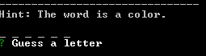
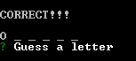
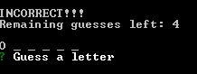
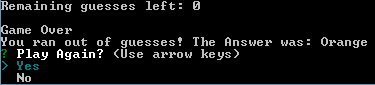
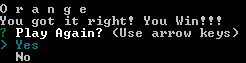
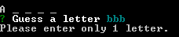
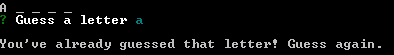

# Constructor-Hangman
Constructor Hangman is a command line node game. A random word is chosen and you must correctly guess each letter of the word. Your remaining number of guesses will go down if you guess incorrectly. If you run out of remaining guesses, the game is over and you lose. Guess the word completely to win the game!

## Instructions For Playing Constructor Hangman:
1. Enter **one** letter from the **English alphabet** and then press enter to make a guess.

2. You will either guess correctly or incorrectly.

3. Repeat 1. until you either run out of guesses or guess the whole word correctly.

4. At the end of each game round, you will be asked if you want to play again. Choose **Yes** to play again with another random word. Choose **No** to end the application.

* You will only be able to guess one letter at a time and cannot guess the same letter twice

## Technologies Used
* Constructors
* Javascript
* HTML
* CSS